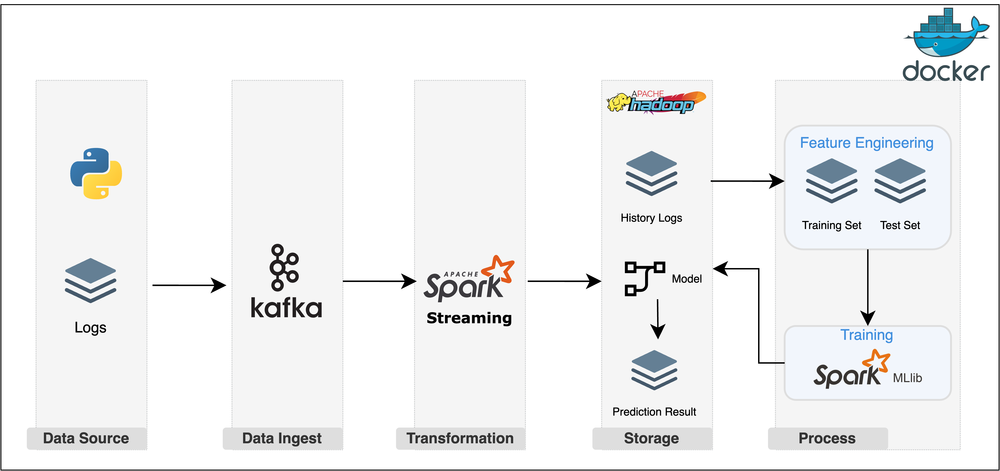
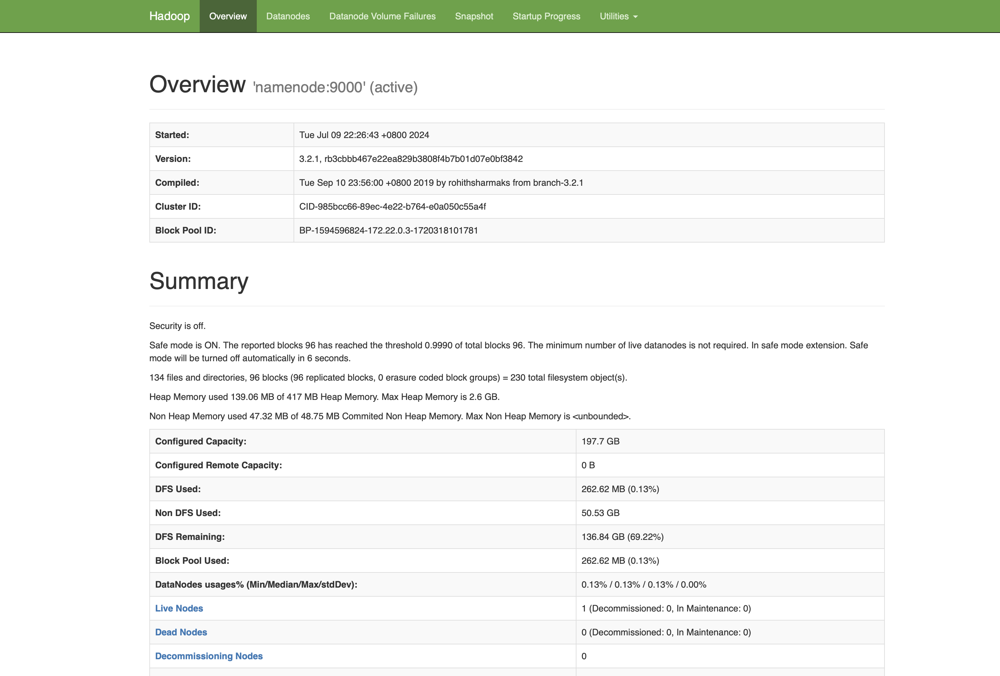
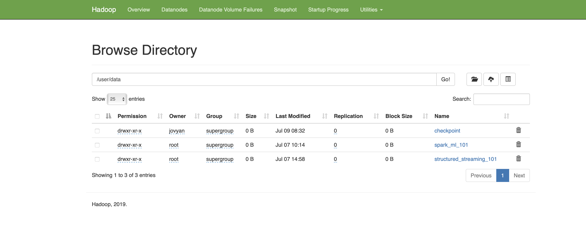
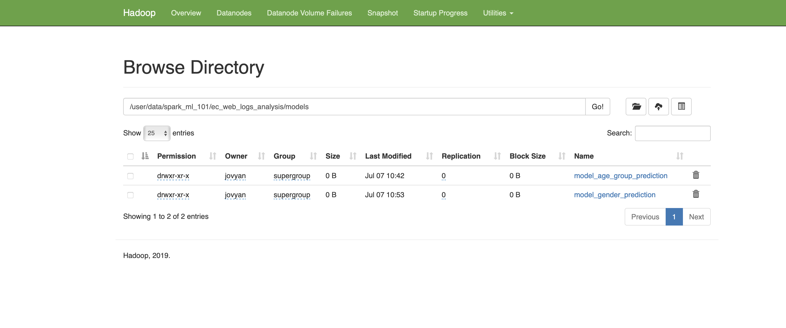
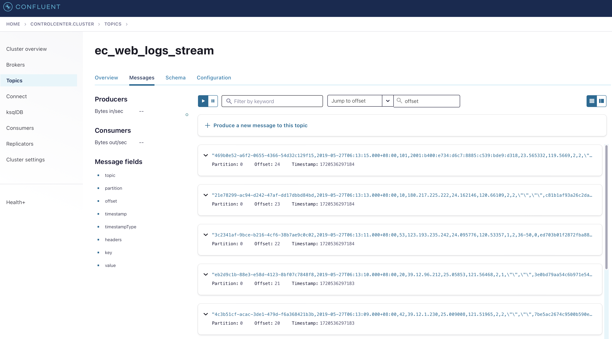
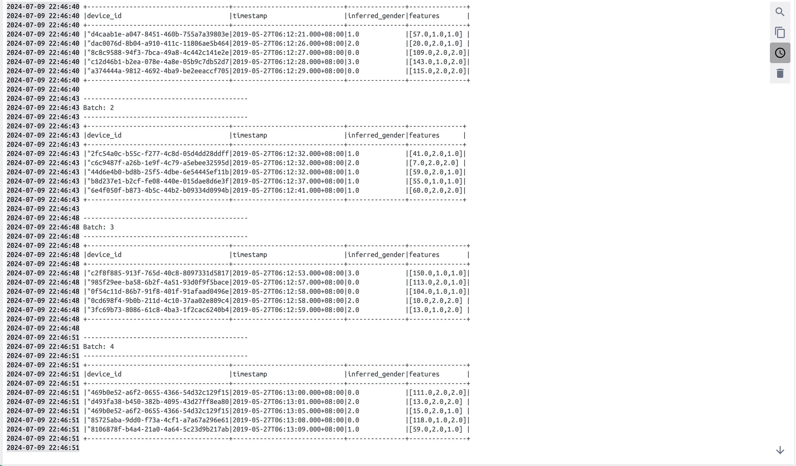
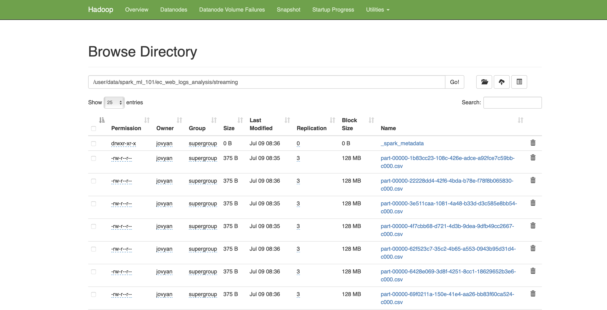

# Hadoop & Spark Machine Learning 

## Introduction
In this project, we leverage the power of Hadoop, Spark MLlib, and Kafka to process and analyze the web log dataset, a large-scale dataset containing web server logs. By combining the strengths of these tools, we are able to effectively store, process, and analyze the large-scale ec_web_log dataset.


## System Architecture

Overview:
- Data Storage and Processing with Hadoop: 
    Hadoop is leveraged to store and process large-scale datasets
- Machine Learning with Spark MLlib: 
    Spark MLlib is utilized to perform feature engineering and model training on the processed data, enabling advanced analytics and predictive capabilities.
- Real-Time Data Ingestion and Streaming with Kafka: 
    Kafka acts as the ingestion layer, collecting and buffering real-time data, which is then consumed by Spark Streaming for real-time data processing and prediction.

## What I Learned
- Setting up a big data storage with HDFS
- Machine Learning with Apache Spark
- Realtime data prodiction with Kafka and Spark streaming
- Containerizing your entire data engineering setup with Docker

## Getting Started
1. Clone the repository:
    ```bash
    git clone https://github.com/HsiuChuanHsu/Hadoop-Spark.git
    ```
2. Navigate to the project directory:
    ```bash
    cd Hadoop-Spark
    ```
3. Install Python dependency management and package: Poetry
- for mac
    ```bash
    brew install poetry
    # or 
    curl -sSL https://install.python-poetry.org | python3 -
    ```

- for windows
    ```bash
    (Invoke-WebRequest -Uri https://install.python-poetry.org -UseBasicParsing).Content | py -
    ```

- Install requirement
    ```bash
    poetry install
    ```

4. Run Docker Compose
    ```bash
    docker-compose up -d
    ```

## Software Architecture
| File | Purpose | 
| :-- | :-- |
|docker-compose.yml| Sets up the entire infrastructure using Docker Compose.|
|notebooks/ec_web_logs_csv_to_parquet.ipynb|Utilizes Jupyter Notebook to convert historical web logs data from CSV format to Parquet format, enabling efficient storage and querying.|
|notebooks/ec_web_logs_age_group_prediction_model.ipynb|Trains an age group prediction model using Spark MLlib on historical web logs data, leveraging machine learning algorithms to predict age groups based on user behavior.|
|notebooks/ec_web_logs_gender_prediction_model.ipynb|Trains a gender prediction model using Spark MLlib on historical web logs data, utilizing machine learning algorithms to predict gender based on user behavior.|
|notebooks/prediction_data_from_kafka.ipynb|Consumes live data from Kafka topics using Jupyter Notebook, performing real-time predictions and analysis.|
|Jobs/produce_date_from_kafka.py|Produces live prediction data from Kafka topics, enabling real-time data processing and analysis.|
|HadoopData/spark_ml_101/ec_web_logs_analysis/raw/logs_201905.csv|Historical web logs data used for machine learning model training.|
|HadoopData/structured_streaming_101/raw/logs_201905_new.csv|Live data source for real-time data processing and analysis.|

## Instructions
### Hadoop Setup and Data Ingestion
Set up the Hadoop environment and ingest the necessary data for the data processing pipeline.

```bash
# Create new folders in Namenode
docker exec -it namenode /bin/bash -c "mkdir -p spark_ml_101"

# Copy local files to Namenode
docker cp HadoopData/spark_ml_101/. namenode:spark_ml_101/.

# Copy data from Namenode to HDFS
docker exec -it namenode /bin/bash -c "hdfs dfs -put spark_ml_101/. /user/data/"
```

You can access the Hadoop web UI at http://localhost:9870 to monitor the HDFS and the overall Hadoop cluster.





### Spark MLlib for Machine Learning Model Training
The Spark MLlib component of the data processing pipeline is utilized to train machine learning models on the historical web logs data. The training process is carried out using Jupyter Notebooks, which can be accessed through the Hadoop web UI at http://127.0.0.1:8888.

- **CSV to Parquet Conversion**
    - The `ec_web_logs_csv_to_parquet.ipynb` Jupyter Notebook is responsible for converting the historical web logs data from CSV format to Parquet format.
    - This conversion process leverages the capabilities of Spark to efficiently transform the data, enabling improved storage and querying performance.
- **Age Group Prediction Model**
    - The `ec_web_logs_age_group_prediction_model.ipynb` Jupyter Notebook trains an age group prediction model using Spark MLlib.
    - The model is trained on the historical web logs data that has been converted to Parquet format.
    - Spark MLlib's machine learning algorithms are utilized to learn patterns in the data and predict the age group of users based on their behavior.
    - The trained model is then stored in HDFS for later use in the data processing pipeline.
- **Gender Prediction Model**
    - The `ec_web_logs_gender_prediction_model.ipynb` Jupyter Notebook trains a gender prediction model using Spark MLlib.
    - Similar to the age group prediction model, this model is trained on the historical web logs data in Parquet format.
    - Spark MLlib's machine learning algorithms are used to learn patterns in the data and predict the gender of users based on their behavior.
    - The trained model is also stored in HDFS for integration with the data processing pipeline.




### Real-Time Data Processing and Prediction
The real-time data processing and prediction component of the pipeline leverages Kafka for data streaming and Spark Structured Streaming for real-time data processing and prediction.

- **Live Data Production to Kafka**
    - The `produce_date_from_kafka.py` script is responsible for producing live data from the `logs_201905_new.csv` source file into the Kafka topic ec_web_logs_stream.
    - This script continuously reads data from the CSV file and publishes it to the Kafka topic, enabling real-time data ingestion.
    - The Kafka web UI at http://localhost:9021 can be used to monitor the data production and consumption within the Kafka cluster.

    


- **Real-Time Data Consumption and Prediction**
    - The `prediction_data_from_kafka.ipynb` Jupyter Notebook is responsible for consuming live data from the ec_web_logs_stream Kafka topic.
    - It utilizes Spark Structured Streaming to consume data from the Kafka topic in real-time.
    - For each record received from the Kafka topic, the notebook performs the following tasks:
    Stores the raw data in CSV format to HDFS for archiving and future reference.
        - Loads the pre-trained age group and gender prediction models from HDFS.
        - Applies the prediction models to the live data to generate age group and gender predictions.
        - Stores the prediction results in HDFS for further analysis and reporting.

    
    


